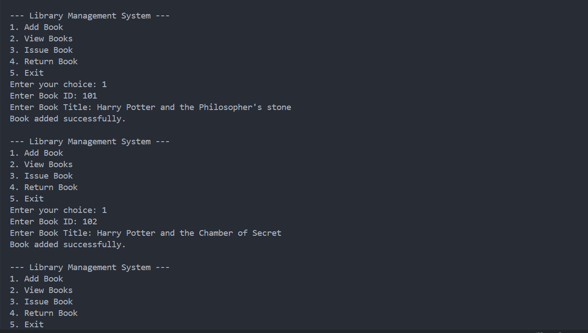

# Library Management System (Java OOP Project)

This is Task 3 submission for the Java Developer Internship (Elevate Labs).

## 🧠 Objective
To build a simple console-based system using OOP concepts to manage books and issue/return them.

## 🛠 Tools Used
- Java (JDK)
- VS Code / IntelliJ
- Command Prompt / Terminal

## 💡 Concepts Used
- OOP (Abstraction, Inheritance, Polymorphism)
- Multi-class structure
- Encapsulation
- ArrayList and Scanner

## 📂 Features
- Add a new book
- View all books
- Issue a book
- Return a book

## 🏃 How to Run
1. Compile:
   javac LibraryManagementSystem.java
2. Run:
   java LibraryManagementSystem

## 📁 Files Included
- LibraryManagementSystem.java
- README.txt
- Interview_Questions.txt

## ✅ Outcome
Gain practical understanding of OOP, especially classes, interfaces, encapsulation, and polymorphism.
